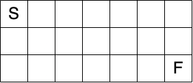
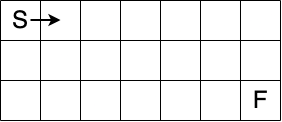
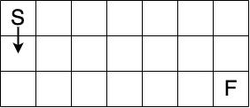

## Chapter 11 Exercise 5 (pg. 182)

This problem is known as the "Unique Paths" problem: Let's say you have a grid of rows and columns. Write a function
that accepts a number of rows and a number of columns, and calculates the number of possible "shortest" paths from the
upper-leftmost square to the lower-rightmost square. For example, here's what the grid looks like with three rows and
seven columns. You want to get from the "S" (Start) to the "F" (Finish).

By "shortest" path, I mean that at every step, you're moving either one step to the right:

or one step downward:

Again, your function should calculate the number of shortest paths.
